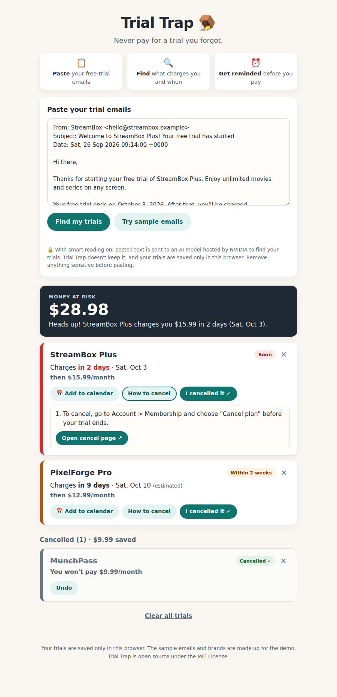

# Trial Trap 🪤

Paste your free-trial signup emails to see which trials are about to charge you, when, how much, and how to cancel. Then add a reminder to your calendar for the day before.



## What it does

- Finds free trials in pasted emails. You can paste one email or several. A line with `---` between emails helps, but emails copied straight from Gmail or Outlook are also recognised.
- Shows a card for each trial with a countdown ("in 2 days"), the charge date and the price after the trial. The cards are sorted by charge date and coloured red within 3 days, amber within 14 days and green after that.
- Adds up the **money at risk** from trials that haven't charged yet.
- **Add to calendar** gives you a Google Calendar link or a `.ics` file for Apple Calendar and Outlook. The reminder is set for 9:00 AM the day before the charge. If that time has already passed, it's set for the next quarter hour.
- **How to cancel** shows the cancel steps and link from the email, if the email has them.
- **I cancelled it ✓** moves a trial to the Cancelled list and counts it as money saved. **×** removes a trial that was read wrongly. Both have an **Undo** button.
- Remembers your trials in the browser between visits, with no account and no database. Pasting the same email twice won't add the trial twice.

## Run it on Windows

You need [Node.js](https://nodejs.org) 22 or newer (the LTS version is fine) and [Git](https://git-scm.com). Without Git, use **Code → Download ZIP** on GitHub and unzip the folder.

Open PowerShell and run:

```powershell
git clone https://github.com/manangoesagain/trial-trap
cd trial-trap
npm install
copy .env.example .env
npm start
```

Open http://localhost:3000, click **Try sample emails**, then **Find my trials**. Press `Ctrl+C` in PowerShell to stop the server.

On macOS or Linux, use `cp .env.example .env` instead of `copy`.

## Smart reading with NVIDIA (optional)

Without an API key, Trial Trap uses its **built-in reader**, which looks for patterns in the email text such as dates, prices and cancel instructions. With a key, it uses an **AI model hosted on NVIDIA's API catalog** instead, which handles more email styles. If the AI is slow, busy, or replies with something that doesn't fit, the app falls back to the built-in reader and tells you.

1. Get a free API key at [build.nvidia.com](https://build.nvidia.com). Keys start with `nvapi-`.
2. Open `.env` in a text editor and paste your key after `NVIDIA_API_KEY=`.
3. You can also set `AI_MODEL` to any chat model listed on build.nvidia.com. The default is `meta/llama-3.3-70b-instruct`.
4. Run `npm start` again. The terminal says whether smart reading is on. It also sends NVIDIA one tiny test message to check that your key can use the model. If something is wrong, it says what, and suggests similar model names when the model isn't found.

`.env` is listed in `.gitignore`, so your key stays on your computer. Only the local server uses the key, and it is never sent to the browser. If `NVIDIA_API_KEY` is also set in your Windows settings, the one in `.env` wins.

## How it works

```
Browser (public/)                Local server (server.js)              NVIDIA API catalog
paste emails ──POST /api/extract──▶ AI reader (lib/aiExtract.js) ──────▶ chat model
                                    │ fails or no key?
                                    ▼
                                  built-in reader (lib/basicExtract.js)
                                    │
                                    ▼
cards, banner, calendar ◀──JSON── every trial checked (lib/validateTrials.js)
saved in localStorage
```

| File | What it does |
| --- | --- |
| `server.js` | Serves the page and the `/api/extract` endpoint, and loads settings from `.env` |
| `lib/aiExtract.js` | Asks the NVIDIA-hosted model to read the emails. It requests a fixed JSON shape and stops waiting after 20 seconds |
| `lib/basicExtract.js` | The built-in reader, which needs no AI |
| `lib/splitEmails.js` | Splits pasted text into separate emails, keeping forwarded emails in one piece |
| `lib/readDates.js` | Reads dates written the ways emails write them, for both readers |
| `lib/validateTrials.js` | Checks and cleans every trial from either reader (real dates, sensible prices, only `http(s)` links) |
| `public/index.html`, `public/styles.css`, `public/app.js` | The page |
| `public/calendar.js` | Builds the Google Calendar link and the `.ics` file |
| `public/storage.js` | Saves trials in the browser's `localStorage` and merges new trials without duplicates |
| `public/dates.js`, `public/trials.js` | Date maths, sorting and totals, shared by the page and the server |
| `public/samples.js` | Three sample emails from made-up brands, dated relative to today |
| `test/` | Tests for all of the above |

## Privacy and safety

- When smart reading is on, the pasted text is sent to NVIDIA's API to be read. When it's off, the text never leaves your computer.
- Trials are saved only in your browser's `localStorage`. The server stores nothing.
- The server only answers on your own computer (`127.0.0.1`), so other people on the same Wi-Fi can't open it or use your NVIDIA key.
- Everything taken from an email is displayed as plain text, never as HTML. Links are used only if they start with `http://` or `https://`.
- The AI is told to treat the emails as data and ignore any instructions written inside them. Its answer must also fit the trial format, or it is thrown away.

## Tests

```powershell
npm test
```

This runs the tests with Node's built-in test runner. They cover both readers, the calendar files, storage and the API. The AI tests use a stand-in NVIDIA server, so you don't need a key to run them.

## Limits

- The sample emails are dated relative to today. Pasting them again on a different day adds new cards.
- Trials are saved per browser. Another browser or device starts empty.
- The built-in reader handles common English email wording. Numeric dates like `04/10/2026` are read day-first when the email uses ₹, €, £, INR, EUR or GBP, and month-first otherwise.
- When an email gives a price without a currency, the price is shown without one rather than guessed.

## How it was planned

Trial Trap was built for the Devpost **Build With AI: Basics** hackathon using the Devpost Learn skill pack. The planning documents are in [`devpost/`](devpost/):

- [`scope.md`](devpost/scope.md) covers what the project is and isn't.
- [`prd.md`](devpost/prd.md) covers what it does for the user.
- [`spec.md`](devpost/spec.md) covers how it is built.
- [`checklist.md`](devpost/checklist.md) is the build plan, done in slices.

## License

[MIT](LICENSE)
